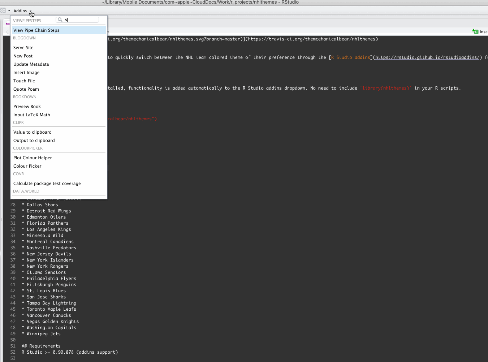

[](https://travis-ci.org/themcehanicalbear/nhlthemes)

# nhlthemes
nhlthemes enables R Studio users to quickly switch between the NHL team colored theme of their preference through the [R Studio addins](https://rstudio.github.io/rstudioaddins/) functionality. This package currenlty only works on MAC. Place the NHL_Light_rstheme file in the ~/.R/rstudio/themes folder on your MAC.

Demo:


Once the nhlthemes package is installed, functionality is added automatically to the R Studio addins dropdown. No need to include `library(nhlthemes)` in your R scripts. 

## Installation
```
# install.packages("devtools")
devtools::install_github("themechanicalbear/nhlthemes")
```

## Valid team theme names are:

* Anaheim Ducks
* Arizona Coyotes
* Boston Bruins
* Buffalo Sabres
* Calgary Flames
* Carolina Hurricanes
* Chicago Blackhawks
* Colorado Avalanche
* Columbus Blue Jackets
* Dallas Stars
* Detroit Red Wings
* Edmonton Oilers
* Florida Panthers
* Los Angeles Kings
* Minnesota Wild
* Montreal Canadiens
* Nashville Predators
* New Jersey Devils
* New York Islanders
* New York Rangers
* Ottawa Senators
* Philadelphia Flyers
* Pittsburgh Penguins
* St. Louis Blues
* San Jose Sharks
* Tampa Bay Lightning
* Toronto Maple Leafs
* Vancouver Canucks
* Vegas Golden Knights
* Washington Capitals
* Winnipeg Jets

## Requirements
R Studio >= 0.99.878 (addins support)
