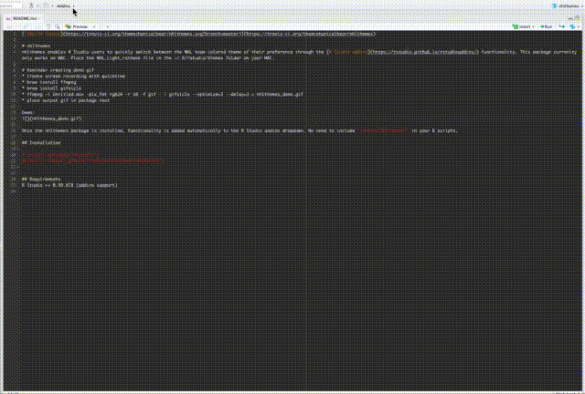

[](https://travis-ci.org/themcehanicalbear/nhlthemes)

# nhlthemes
nhlthemes enables R Studio users to quickly switch between the NHL team colored theme of their preference through the [R Studio addins](https://rstudio.github.io/rstudioaddins/) functionality. This package currenlty only works on MAC. Place the NHL_Light_rstheme file in the ~/.R/rstudio/themes folder on your MAC.

# Reminder creating demo gif
* Create screen recording with quicktime (export as 480p for smaller file)
* brew install ffmpeg
* brew install gifsicle
* ffmpeg -i Untitled.mov -pix_fmt rgb24 -r 10 -f gif - | gifsicle --optimize=3 --delay=10 > nhlthemes_demo.gif
* place output gif in package root

Demo:


Once the nhlthemes package is installed, functionality is added automatically to the R Studio addins dropdown. No need to include `library(nhlthemes)` in your R scripts. 

## Installation
```
# install.packages("devtools")
devtools::install_github("themechanicalbear/nhlthemes")
```

## Requirements
R Studio >= 0.99.878 (addins support)
